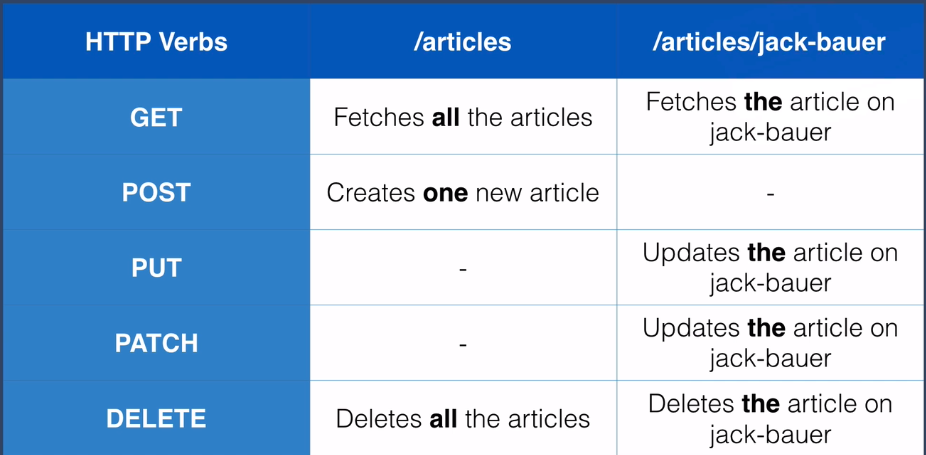

# [REST Software Architectural Style](https://pt.wikipedia.org/wiki/REST)

## _What is REST?_
- The term REST stands for "**RE**presentational **S**tate **T**ransfer".
- It' is a **software architecture style for API's** in modern web apps.
- It has a set of **rules** that developers need to follow to develop a REST software.
- It came to estabilish a **pattern between API's**, making it easy to understand for every developer a **RESTful API**.

## _What is a RESTful API?_
- A RESTful API is an API that implements the REST Architectural Style, following all it's rules and patterns.

## _Which are the REST rules then?_
1. **Use HTTP Request Verbs**
    - GET (READ's data from server).
    - POST (CREATE's data on server).
    - PUT && PATCH (UPDATE's data on server).
      - PUT overwrites the **entire** data on server.
      - PATCH overwrites **a piece of** data on server.
    - DELETE (DELETE's data from server).
2. **Use Specific Pattern of Routes/Endpoinst URLs**
    - Build a RESTful routing (route name suggests content transfer on route).
    - Exemple of a RESTful routing. 
    - Another example -> [RESTful API](RESTful-api)