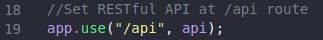

# WikiDB RESTful API Example
- In this example, were are going to use MongoDB with a DB called WikiDB. In this db, there's a collection called articles, which is going to be our RESTful route.

## _Project Organization_
- At our [`app.js`](app.js) file, we are requiring our RESTful API route and setting it's root to `/api`, so it's resources can be accessed at this route. 
- The API routes are being defined at [./routes/index.js](routes/index.js)
  ```javascript
  const route = require("express").Router();

  const articleRoute = require("./article");

  //articles RESTful Route to handle req
  route.use("/articles", articleRoute);

  module.exports = route;
  ```
- and the `/articles` endpoint is created at [./routes/article.js](routes/article.js)
- The controller for `/articles` api route is at [./controllers/articleController.js](controllers/articleController.js)

## _RESTful API Docs_
- API Endpoint: `localhost:3000/api`
- POSTMAN collection: [Wiki API](https://www.getpostman.com/collections/d78ee2661dce9628c41e)
#### Routes
- `/articles`
  - **GET** - retrieve all articles
  - **POST** - post a article
    - body 
      ```javascript 
      {
        title: String,
        content: String
      }
      ```
  - **DELETE** - deletes all articles
- `/articles/:name`
  - **GET** - get a article by it's name
  - **PUT** - put a article by it's name, overwriting all the document
    - body 
      ```javascript 
      {
        title: String, //If not sent, the attribute will be deleted from the document
        content: String //If not sent, the attribute will be deleted from the document
      }
      ```
    - **PUT** - patch a article by it's name, changing the document attributes
    - body 
      ```javascript 
      {
        title: String, //If not sent, the attribute will preserved from the previous document
        content: String //If not sent, the attribute will preserved from the previous document
      }
      ```
  - **DELETE** - delete a article by it's name