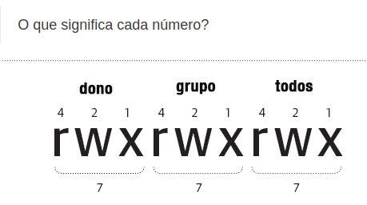

# Linux Terminal

## Commands list
- **Directory Commands**
  - `pwd` -> shows current directory 
  - `cd [$path]`  -> (Change Directory) used to navigate through directories
  - `ls [$path]`  -> (List) list current directory contents
    - `ls -l [$path]` -> -l flag makes ls show more info over files
  - `mkdir [$dirName]` -> (Make Directory) creates a folder

- **Console Commands**
  - `clear` -> clear console contents 
  - `history` -> show commands history
  - `echo [$string]` -> prints string
    - `echo "Hello World" > output.txt` -> Redirects `echo` output to `output.txt` file

- **File Management Commands**
  - `cat [$file]` -> concatenates file contents to console
  - `gedit [$file]` -> opens text editor for a file
  - `cp [$src] [$dest]` -> copies src to dest
  - `mv [$src] [$dest]` -> command used to move/rename files
  - `rm [$file]` -> removes a file
    - `rm -rf` -> rf is a flag, r makes removal recursive(removes inner files), f makes removal forced(remove files ignoring restrictions)

- [**File Permissions**](https://www.cbtnuggets.com/blog/technology/system-admin/when-to-use-chmod-vs-chown)
  
  1. The “-” tells us the file is a regular file type. Other common types include: “d” for directories and “l” for symlinks
  2. These are the permissions for the file, and there are three parts: user (first rw-), group (second rw-) and all users & groups (third rw-). Here’s a further breakdown of the permission component:
  
  3. Number of links to the file
  4. Name of the user that owns the file.
  5. Name of the group that owns the file.
  6. The size of the file in bytes.
  7. The date and time that the file was created or last modified.
  8. File name
  - Given that, we can see that "cooluser," the "cooluser" group, and all other users and groups have "read" and "write" permissions on learningnotes.txt.
  - Those characters that represent read, write, and execute permissions are also expressed numerically as decimal and binary numbers (this becomes important with chmod). Here is the breakdown:
    Permission | Binary value | Decimal value
    ---------- | ------------ | -------------
    No permission (---) | 000 | 0
    Execute only (--x) | 001 | 1
    Write only (-w-) | 010 | 2
    Read only (r--) | 100 | 4
    Write and execute (-wx) | 011 | 3
    Read and execute (r-x) | 101 | 5
    Read and write (rw-) | 110 | 6
    Read, write, and execute (rwx) | 111 | 7
    > Don't worry too much about memorizing this table for now, it will come with time and practice. Just remember read = 4, write = 2, and execute = 1.
- **File Permission Commands**
  - `chmod` -> change file permissions
    - `chmod 777 file.txt` -> give `file.txt` all permissions
    
      - r -> permission to read 
      - w -> permission to write
      - x -> permission to execute
    - `chmod 777 -R *` -> give **all files**(-R flag) in current directory 
    - `chmod +x file.sh` -> give **file.sh** in current directory execution permissions to all groups (chmod 111 file.sh)
  - `chown` -> change file owner
    - `chown valtim:valtim file.txt` -> change file owner
- **Process Management Commands**
  - `top` -> show all running processes
  - `[$program] &` -> put program to run on background as a process
  - `kill -9 [$processId]` -> stop process
- **Super User**
  - `sudo` -> give commands root privileges
    - `sudo apt-get install htop` -> installs htop
    - `sudo su` -> change current user to root
- **Using VI terminal editor**
  - `i` -> pressing **i** enters insertion mode (edit file)
  - `esc` -> pressing **esc** returns to commando mode 
  - `d` -> pressing double **d** deletes a line
  - `enter` -> pressing **enter** go to next line
  - **Commands**
    - `:[$number]` -> jumps file to $number row
    - `:q` -> quit file
      - `:q!` -> quit ignoring changes
    - `:w` -> write file
    - `:x` == `:wq` -> writes file and quits
    - `/[$search]` -> find $search in file
- **Shell Script**
  - `script.sh` -> file containing a shell script(combination of shell commands)
  - `bash [$fileScript]` -> terminal command to run shell scripts 
  - `#!/bin/bash` -> functional comment sinalizing script to run using bash

- **Shutdown Commands**
  - `sudo shutdown -r now` -> restart computer now
  - `sudo shutdown -h now` -> turn off computer now
  - `exit` -> exit terminal